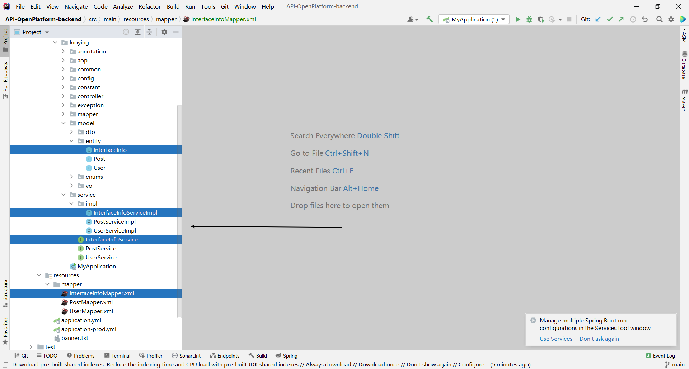
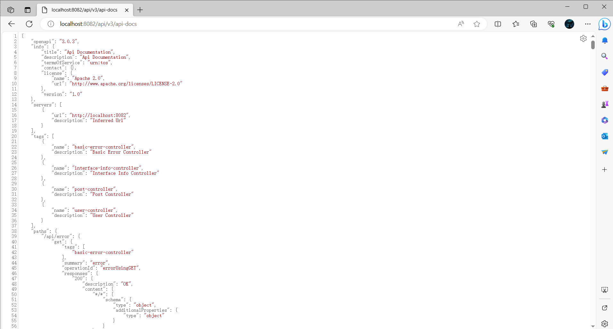
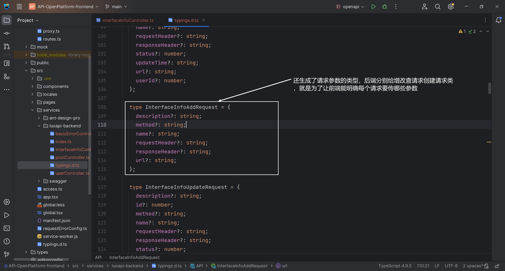
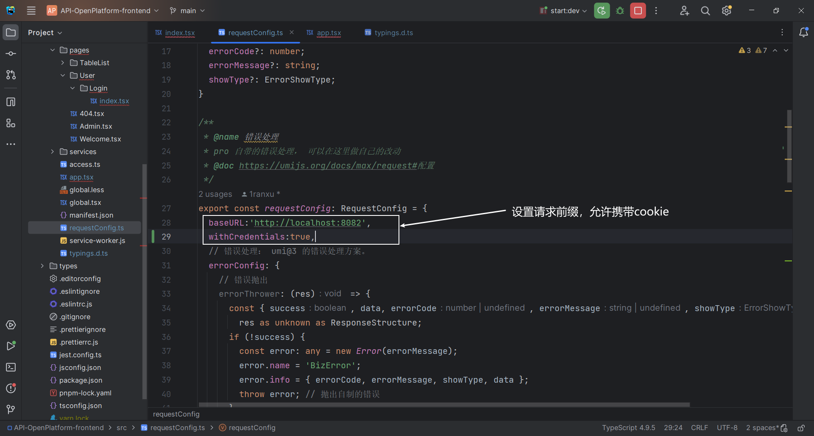
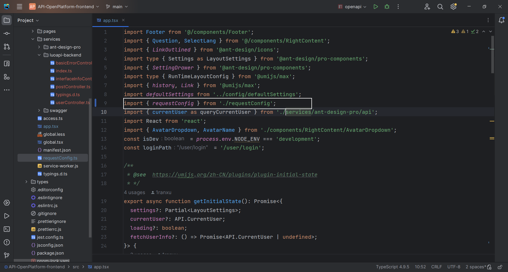
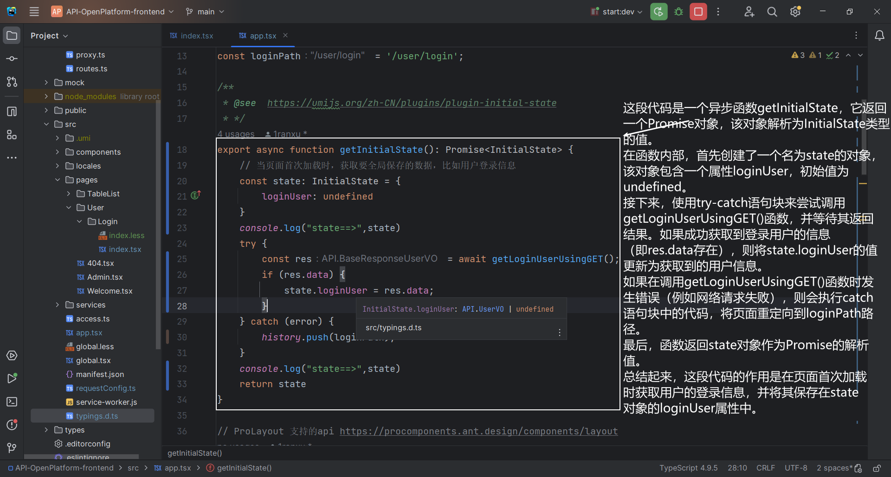
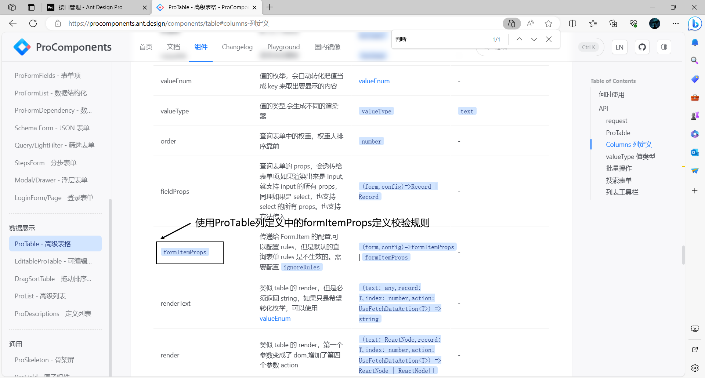
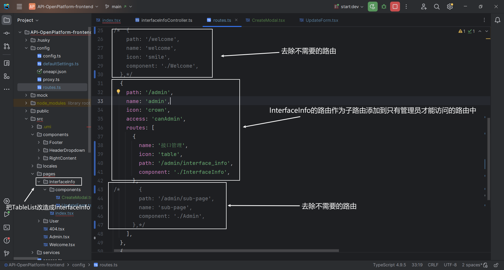
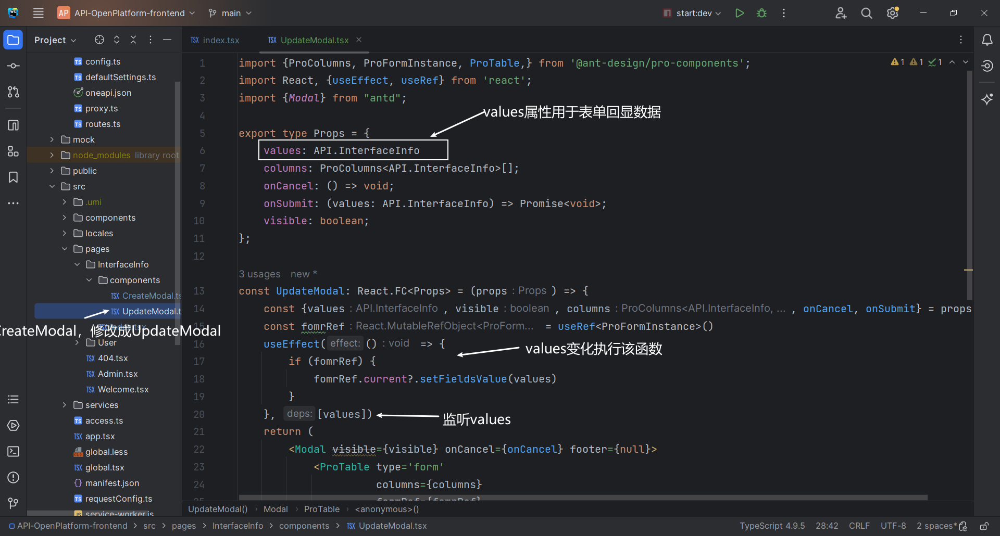
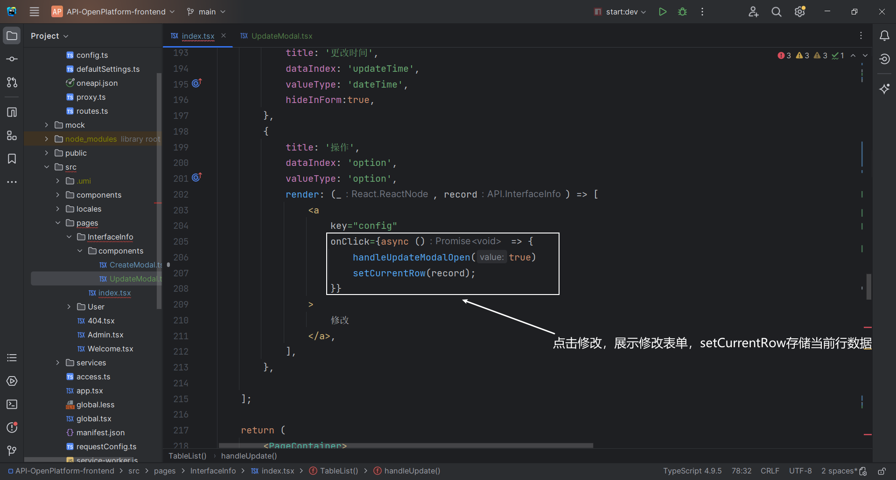

# 落樱接口

背景：

1. 前端开发需要用到后端j接口
2. 使用别人现成系统的功能[搏天api-免费api接口平台 (btstu.cn)](https://api.btstu.cn/)

考虑：

1. 防止攻击（安全性）
2. 不能随便调用（增加限制）
3. 统计调用次数
4. 计费
5. 流量保护（限制单位i时间请求数量）
6. API接入（每开发一个API要复用以上的特性）

## 项目介绍

落樱接口是一个提供接口调用的平台，用户可以注册登录，开通接口调用权限，用户可以调用接口，每次调用会进行统计。

管理员可以发布接口，下线接口，接入接口，可视化接口的调用情况

## 业务流程


## 技术选型

**前端**

- Ant Design Pro

- React

- Ant Design & Pro Components

- Umi
- Umi Request （Axios的封装）

**后端**

- Java
- SpringBoot

## 计划

**初始化**

- 前端
- 后端

**数据库表设计**

**基础功能**

- 后端接口管理
  - 管理员可以对接口进行增删改查

- 前端接口管理
  - 管理员可以访问前台查看接口
  - 管理员创建接口，更新接口，删除接口

**接口调用**

- 开发模拟接口，调用模拟接口
- 保证调用的安全性（API签名认证）
- 客户端SDK开发
- 管理员发布接口与调用
- 接口文档展示，接口在线调用

**接口计费与保护**

- 统计用户调用次数

- 限流

- 计费 

- 日志

- 开通

**接口统计**

- 提供可视化平台，用图表展示所有接口的调用情况，便于管理
- 接口预警

## 需求分析

1. 管理员可以对接口进行增删改查
2. 用户可以访问前台查看，查看接口信息

## 初始化

### 前端

1. 初始化脚手架

```sh
#使用pro-cli 来快速的初始化脚手架。
npm i @ant-design/pro-cli -g
pro create API-OpenPlatform-frontend
```


2. 确认版本


3. 安装依赖

```sh
yarn
```

### 后端

使用SpringBoot 项目初始模板(旧)

## 数据库表设计

**接口信息表interface_info**

id

name 接口名称

description 接口描述

url 接口地址

requestHeader 请求头

responseHeader 响应头

status 接口状态 0-关闭 1-开启

method 请求类型

userId 创建人

isDelete 

createTime

updateTime

```sql
create table interface_info
(
    id             bigint auto_increment comment '主键'
        primary key,
    name           varchar(256)                       not null comment '接口名称',
    description    varchar(1024)                      null comment '接口描述',
    url            varchar(512)                       not null comment '接口地址',
    requestHeader  text                               null comment '请求头',
    responseHeader text                               null comment '响应头',
    status         tinyint  default 0                 not null comment '接口状态 0-关闭 1-开启',
    method         varchar(256)                       not null comment '请求类型',
    userId         bigint                             not null comment '创建人',
    createTime     datetime default CURRENT_TIMESTAMP not null comment '创建时间',
    updateTime     datetime default CURRENT_TIMESTAMP not null on update CURRENT_TIMESTAMP comment '更新时间',
    idDelete       tinyint  default 0                 not null comment '逻辑删除'
);
```

## 基础功能

### 后端接口管理

**管理员可以对接口进行增删改查**

1. 使用MybatisX自动生成mapper层和service层的代码




```java
@Data
public class InterfaceInfoAddRequest implements Serializable {
    /**
     * 接口名称
     */
    private String name;

    /**
     * 接口描述
     */
    private String description;

    /**
     * 接口地址
     */
    private String url;

    /**
     * 请求头
     */
    private String requestHeader;

    /**
     * 响应头
     */
    private String responseHeader;

    /**
     * 请求类型
     */
    private String method;
}
```

```java
@EqualsAndHashCode(callSuper = true)
@Data
public class InterfaceInfoQueryRequest extends PageRequest implements Serializable {
    /**
     * id
     */
    private Long id;

    /**
     * 接口名称
     */
    private String name;

    /**
     * 接口描述
     */
    private String description;

    /**
     * 接口地址
     */
    private String url;

    /**
     * 请求头
     */
    private String requestHeader;

    /**
     * 响应头
     */
    private String responseHeader;

    /**
     * 接口状态 0-关闭 1-开启
     */
    private Integer status;

    /**
     * 请求类型
     */
    private String method;

    /**
     * 创建人
     */
    private Long userId;
}
```

```java
@Data
public class InterfaceInfoUpdateRequest implements Serializable {
    /**
     * 主键
     */
    private Long id;

    /**
     * 接口名称
     */
    private String name;

    /**
     * 接口描述
     */
    private String description;

    /**
     * 接口地址
     */
    private String url;

    /**
     * 请求头
     */
    private String requestHeader;

    /**
     * 响应头
     */
    private String responseHeader;

    /**
     * 接口状态 0-关闭 1-开启
     */
    private Integer status;

    /**
     * 请求类型
     */
    private String method;
}
```

```java
public interface InterfaceInfoService extends IService<InterfaceInfo> {

    /**
     * 校验
     *
     * @param interfaceInfo
     * @param add 是否为创建校验
     */
    void validInterfaceInfo(InterfaceInfo interfaceInfo, boolean add);
}
```

```java
@Service
public class InterfaceInfoServiceImpl extends ServiceImpl<InterfaceInfoMapper, InterfaceInfo>
        implements InterfaceInfoService {
    @Override
    public void validInterfaceInfo(InterfaceInfo interfaceInfo, boolean add) {
        Long id = interfaceInfo.getId();
        String name = interfaceInfo.getName();
        String description = interfaceInfo.getDescription();
        String url = interfaceInfo.getUrl();
        String requestHeader = interfaceInfo.getRequestHeader();
        String responseHeader = interfaceInfo.getResponseHeader();
        Integer status = interfaceInfo.getStatus();
        String method = interfaceInfo.getMethod();
        Long userId = interfaceInfo.getUserId();
        Date createTime = interfaceInfo.getCreateTime();
        Date updateTime = interfaceInfo.getUpdateTime();
        Integer idDelete = interfaceInfo.getIdDelete();
        if (interfaceInfo == null) {
            throw new BusinessException(ErrorCode.PARAMS_ERROR);
        }
        // 创建时，所有参数必须非空
        if (add) {
            if (StringUtils.isAnyBlank(name)) {
                throw new BusinessException(ErrorCode.PARAMS_ERROR);
            }
        }
        if (StringUtils.isAnyBlank(name) && name.length() > 50) {
            throw new BusinessException(ErrorCode.PARAMS_ERROR, "接口名称过长");
        }
    }
}
```

2. 复制PostContoller改写成InterfacerInfoController

```java
/**
 * 接口信息
 *
 * @author 落樱的悔恨
 */
@RestController
@RequestMapping("/interfaceInfo")
@Slf4j
public class InterfaceInfoController {

    @Resource
    private InterfaceInfoService interfaceInfoService;

    @Resource
    private UserService userService;

    // region 增删改查

    /**
     * 创建
     *
     * @param interfaceInfoAddRequest
     * @param request
     * @return
     */
    @PostMapping("/add")
    public BaseResponse<Long> addInterfaceInfo(@RequestBody InterfaceInfoAddRequest interfaceInfoAddRequest, HttpServletRequest request) {
        if (interfaceInfoAddRequest == null) {
            throw new BusinessException(ErrorCode.PARAMS_ERROR);
        }
        InterfaceInfo interfaceInfo = new InterfaceInfo();
        BeanUtils.copyProperties(interfaceInfoAddRequest, interfaceInfo);
        // 校验
        interfaceInfoService.validInterfaceInfo(interfaceInfo, true);
        User loginUser = userService.getLoginUser(request);
        interfaceInfo.setUserId(loginUser.getId());
        boolean result = interfaceInfoService.save(interfaceInfo);
        if (!result) {
            throw new BusinessException(ErrorCode.OPERATION_ERROR);
        }
        long newInterfaceInfoId = interfaceInfo.getId();
        return ResultUtils.success(newInterfaceInfoId);
    }

    /**
     * 删除
     *
     * @param deleteRequest
     * @param request
     * @return
     */
    @PostMapping("/delete")
    public BaseResponse<Boolean> deleteInterfaceInfo(@RequestBody DeleteRequest deleteRequest, HttpServletRequest request) {
        if (deleteRequest == null || deleteRequest.getId() <= 0) {
            throw new BusinessException(ErrorCode.PARAMS_ERROR);
        }
        User user = userService.getLoginUser(request);
        long id = deleteRequest.getId();
        // 判断是否存在
        InterfaceInfo oldInterfaceInfo = interfaceInfoService.getById(id);
        if (oldInterfaceInfo == null) {
            throw new BusinessException(ErrorCode.NOT_FOUND_ERROR);
        }
        // 仅本人或管理员可删除
        if (!oldInterfaceInfo.getUserId().equals(user.getId()) && !userService.isAdmin(request)) {
            throw new BusinessException(ErrorCode.NO_AUTH_ERROR);
        }
        boolean b = interfaceInfoService.removeById(id);
        return ResultUtils.success(b);
    }

    /**
     * 更新
     *
     * @param interfaceInfoUpdateRequest
     * @param request
     * @return
     */
    @PostMapping("/update")
    public BaseResponse<Boolean> updateInterfaceInfo(@RequestBody InterfaceInfoUpdateRequest interfaceInfoUpdateRequest,
                                            HttpServletRequest request) {
        if (interfaceInfoUpdateRequest == null || interfaceInfoUpdateRequest.getId() <= 0) {
            throw new BusinessException(ErrorCode.PARAMS_ERROR);
        }
        InterfaceInfo interfaceInfo = new InterfaceInfo();
        BeanUtils.copyProperties(interfaceInfoUpdateRequest, interfaceInfo);
        // 参数校验
        interfaceInfoService.validInterfaceInfo(interfaceInfo, false);
        User user = userService.getLoginUser(request);
        long id = interfaceInfoUpdateRequest.getId();
        // 判断是否存在
        InterfaceInfo oldInterfaceInfo = interfaceInfoService.getById(id);
        if (oldInterfaceInfo == null) {
            throw new BusinessException(ErrorCode.NOT_FOUND_ERROR);
        }
        // 仅本人或管理员可修改
        if (!oldInterfaceInfo.getUserId().equals(user.getId()) && !userService.isAdmin(request)) {
            throw new BusinessException(ErrorCode.NO_AUTH_ERROR);
        }
        boolean result = interfaceInfoService.updateById(interfaceInfo);
        return ResultUtils.success(result);
    }

    /**
     * 根据 id 获取
     *
     * @param id
     * @return
     */
    @GetMapping("/get")
    public BaseResponse<InterfaceInfo> getInterfaceInfoById(long id) {
        if (id <= 0) {
            throw new BusinessException(ErrorCode.PARAMS_ERROR);
        }
        InterfaceInfo interfaceInfo = interfaceInfoService.getById(id);
        return ResultUtils.success(interfaceInfo);
    }

    /**
     * 获取列表（仅管理员可使用）
     *
     * @param interfaceInfoQueryRequest
     * @return
     */
    @AuthCheck(mustRole = "admin")
    @GetMapping("/list")
    public BaseResponse<List<InterfaceInfo>> listInterfaceInfo(InterfaceInfoQueryRequest interfaceInfoQueryRequest) {
        InterfaceInfo interfaceInfoQuery = new InterfaceInfo();
        if (interfaceInfoQueryRequest != null) {
            BeanUtils.copyProperties(interfaceInfoQueryRequest, interfaceInfoQuery);
        }
        QueryWrapper<InterfaceInfo> queryWrapper = new QueryWrapper<>(interfaceInfoQuery);
        List<InterfaceInfo> interfaceInfoList = interfaceInfoService.list(queryWrapper);
        return ResultUtils.success(interfaceInfoList);
    }

    /**
     * 分页获取列表
     *
     * @param interfaceInfoQueryRequest
     * @param request
     * @return
     */
    @GetMapping("/list/page")
    public BaseResponse<Page<InterfaceInfo>> listInterfaceInfoByPage(InterfaceInfoQueryRequest interfaceInfoQueryRequest, HttpServletRequest request) {
        if (interfaceInfoQueryRequest == null) {
            throw new BusinessException(ErrorCode.PARAMS_ERROR);
        }
        InterfaceInfo interfaceInfoQuery = new InterfaceInfo();
        BeanUtils.copyProperties(interfaceInfoQueryRequest, interfaceInfoQuery);
        long current = interfaceInfoQueryRequest.getCurrent();
        long size = interfaceInfoQueryRequest.getPageSize();
        String sortField = interfaceInfoQueryRequest.getSortField();
        String sortOrder = interfaceInfoQueryRequest.getSortOrder();
        String description = interfaceInfoQuery.getDescription();
        // content 需支持模糊搜索
        interfaceInfoQuery.setDescription(null);
        // 限制爬虫
        if (size > 50) {
            throw new BusinessException(ErrorCode.PARAMS_ERROR);
        }
        QueryWrapper<InterfaceInfo> queryWrapper = new QueryWrapper<>(interfaceInfoQuery);
        queryWrapper.like(StringUtils.isNotBlank(description), "description", description);
        queryWrapper.orderBy(StringUtils.isNotBlank(sortField),
                sortOrder.equals(CommonConstant.SORT_ORDER_ASC), sortField);
        Page<InterfaceInfo> interfaceInfoPage = interfaceInfoService.page(new Page<>(current, size), queryWrapper);
        return ResultUtils.success(interfaceInfoPage);
    }

    // endregion

}
```

### 前端配置代码美化插件

1. 配置代码规范美化插件，方便快速格式化 


### 自动生成后端请求代码

使用前端Ant Design Pro框架集成的openapi插件生成向后端发请求的代码（该插件依赖后端遵循openapi规范的swagger文档）







### 修改requestErrorConfig








### 测试登录接口





### 管理员查看接口





### 修改路由




### 整体页面风格设置


### 管理员创建接口


### 管理员更新接口







### 管理员删除接口


